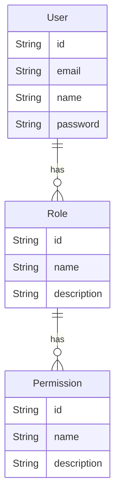

# Database Schema Documentation

This document describes the database schema for the application, specifically focusing on the Role-Based Access Control (RBAC) system implemented using Prisma.

## Overview

The system uses a flexible RBAC model allowing users to have multiple roles, and roles to have multiple granular permissions.

## Models

### User

Represents an authenticated user of the system.

- **id**: Unique identifier (CUID).
- **email**: User's email address (Unique).
- **name**: User's full name (Optional).
- **password**: Hashed password.
- **roles**: Relation to `Role` model (Many-to-Many).

### Role

Defines a role within the system (e.g., `ADMIN`, `EDITOR`, `VIEWER`).

- **id**: Unique identifier (CUID).
- **name**: Unique name of the role.
- **description**: Optional description of the role's purpose.
- **users**: Relation to `User` model (Many-to-Many).
- **permissions**: Relation to `Permission` model (Many-to-Many).

### Permission

Defines a specific granular permission (e.g., `user:create`, `report:view`).

- **id**: Unique identifier (CUID).
- **name**: Unique name of the permission.
- **description**: Optional description of what the permission allows.
- **roles**: Relation to `Role` model (Many-to-Many).

## Entity Relationship Diagram (ERD)

## Relationships

- **User <-> Role**: A user can handle multiple roles, and a role can be assigned to multiple users.
- **Role <-> Permission**: A role consists of multiple permissions, and a permission can be part of multiple roles.

This design allows for high scalability. New features can simply add new `Permission` records, which can then be grouped into existing or new `Role`s without changing the database structure.
